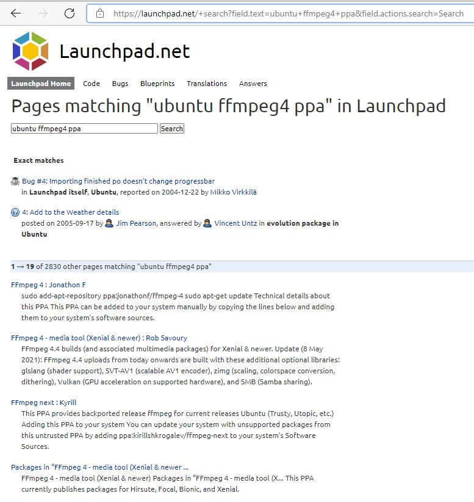
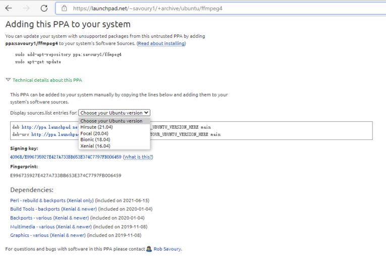

# Ubuntu 16.04/18.04/20.04 安装 ffmpeg4.4

​        最近在玩以太网推视频流。由于自身不是做上层应用层软件出生，只能现有工具的手段完成。通过Google和度娘搜索有两种方案：FFmpeg和GStreamer的方案。最终我选择使用FFmpeg工具。

​        [FFmpeg_百度百科 (baidu.com)](https://baike.baidu.com/item/ffmpeg/2665727?fr=aladdin) 是一套可以用来记录、转换数字音频、视频，并能将其转化为流的开源计算机程序。采用LGPL或[GPL](https://baike.baidu.com/item/GPL/2357903)许可证。它提供了录制、转换以及流化音视频的完整解决方案。它包含了非常先进的音频/视频编解码库libavcodec，为了保证高可移植性和编解码质量，libavcodec里很多code都是从头开发的。

FFmpeg在[Linux](https://baike.baidu.com/item/Linux/27050)平台下开发，但它同样也可以在其它操作系统环境中编译运行，包括[Windows](https://baike.baidu.com/item/Windows/165458)、[Mac OS X](https://baike.baidu.com/item/Mac OS X/470629)等。这个项目最早由Fabrice Bellard发起，2004年至2015年间由Michael Niedermayer主要负责维护。许多FFmpeg的开发人员都来自[MPlayer](https://baike.baidu.com/item/MPlayer/3086899)项目，而且当前FFmpeg也是放在MPlayer项目组的服务器上。项目的名称来自MPEG[视频编码标准](https://baike.baidu.com/item/视频编码标准/3201394)，前面的"FF"代表"Fast Forward"。 [1] FFmpeg编码库可以使用[GPU](https://baike.baidu.com/item/GPU/105524)加速。

​        我的Linux服务器是Ubuntu16.04。下面方法适用于Ubuntu16.04以上任何版本的Ubuntu。

## 给当前Ubuntu添加PPA源

​        PPA是Personal Package Archives首字母简写。翻译为中文意思是：个人软件包文档。只有Ubuntu用户可以用，而所有的PPA都是寄存在[launchpad.net](https://launchpad.net/)网站上。使用PPA的好处是Ubuntu系统中使用PPA源的软件可以让你在第一时间体验到最新版本的软件。

​        所以我们需要在[launchpad.net](https://launchpad.net/)网站上搜索我们对应Ubuntu16.04的ffmpeg4 ppa软件包。



点开[FFmpeg 4 - media tool (Xenial & newer) : Rob Savoury](https://launchpad.net/~savoury1/+archive/ubuntu/ffmpeg4)



非常感谢**Rob Savoury**，他的**ppa:savoury1**包含了Ubuntu版本比较多从Ubuntu 16.04(Xenial)到Ubuntu20.04(Focal)。


**增加PPA并升级相应的软件包：**

```bash
$ sudo add-apt-repository ppa:savoury1/graphics
$ sudo add-apt-repository ppa:savoury1/multimedia
$ sudo add-apt-repository ppa:savoury1/ffmpeg4
$ sudo apt-get update
$ sudo apt-get upgrade && sudo apt-get dist-upgrade
$ sudo apt-get install ffmpeg

```

命令log如下：

```bash
$ sudo add-apt-repository ppa:savoury1/graphics
$ sudo add-apt-repository ppa:savoury1/multimedia
$ sudo add-apt-repository ppa:savoury1/ffmpeg4
 FFmpeg 4.4 builds (and associated multimedia packages) for Xenial & newer.

Update (8 May 2021): FFmpeg 4.4 uploads from today onwards are built with these additional optional libraries: glslang (shader support), SVT-AV1 (scalable AV1 encoder), zimg (scaling, colorspace conversion, dithering), Vulkan (GPU acceleration on supported hardware), and SMB (Samba sharing).

==========================================================================
                   FFmpeg 4 - media tool (Xenial & newer)
==========================================================================

......
......

*** Install ***

FFmpeg can be installed from this PPA alone, as the required packages to satisfy minimum versions have been copied here (notify me if any missing). However, if _all_ newest versions of graphics and multimedia packages are desired then two additional PPAs can be added before installing FFmpeg:

  sudo add-apt-repository ppa:savoury1/graphics
  sudo add-apt-repository ppa:savoury1/multimedia
  sudo add-apt-repository ppa:savoury1/ffmpeg4
  sudo apt-get update
  sudo apt-get upgrade && sudo apt-get dist-upgrade
  sudo apt-get install ffmpeg

......
......

*** Build ***

This PPA has build dependencies on:

  ppa:savoury1/build-tools
  ppa:savoury1/backports
  ppa:savoury1/graphics
  ppa:savoury1/multimedia

*** Credits ***

......
......

Press [ENTER] to continue or ctrl-c to cancel adding it

gpg: keyring `/tmp/tmpq1hloyh6/secring.gpg' created
gpg: keyring `/tmp/tmpq1hloyh6/pubring.gpg' created
gpg: requesting key FB006459 from hkp server keyserver.ubuntu.com
gpg: /tmp/tmpq1hloyh6/trustdb.gpg: trustdb created
gpg: key FB006459: public key "Launchpad PPA for Rob Savoury" imported
gpg: Total number processed: 1
gpg:               imported: 1  (RSA: 1)
OK
$ sudo apt-get update
Hit:1 http://mirrors.aliyun.com/docker-ce/linux/ubuntu xenial InRelease
Hit:2 https://mirrors.aliyun.com/docker-ce/linux/ubuntu xenial InRelease                                                         Hit:3 http://ppa.launchpad.net/savoury1/ffmpeg4/ubuntu xenial InRelease                                                         ......
......
Get:23 http://ppa.launchpad.net/savoury1/multimedia/ubuntu xenial/main Translation-en [113 kB]                                   
Fetched 2,023 kB in 8s (234 kB/s)                                                      
Reading package lists... Done
W: Duplicate sources.list entry https://mirrors.aliyun.com/docker-ce/linux/ubuntu xenial Release

$ sudo apt-get upgrade && sudo apt-get dist-upgrade
$ sudo apt-get install ffmpeg
```

**Check当前ffmpeg的版本：**

```bash
$ ffmpeg -version
ffmpeg version 4.4-1ubuntu0~16.04.sav0.1 Copyright (c) 2000-2021 the FFmpeg developers
built with gcc 5.4.0 (Ubuntu 5.4.0-6ubuntu1~16.04.12) 20160609
configuration: --prefix=/usr --extra-version='1ubuntu0~16.04.sav0.1' --toolchain=hardened --libdir=/usr/lib/x86_64-linux-gnu --incdir=/usr/include/x86_64-linux-gnu --arch=amd64 --enable-gpl --disable-stripping --enable-avresample --disable-filter=resample --enable-gnutls --enable-ladspa --enable-libaom --enable-libass --enable-libbluray --enable-libbs2b --enable-libcaca --enable-libcdio --enable-libcodec2 --enable-libdav1d --enable-libflite --enable-libfontconfig --enable-libfreetype --enable-libfribidi --enable-libgme --enable-libgsm --enable-libjack --enable-libmp3lame --enable-libmysofa --enable-libopenjpeg --enable-libopenmpt --enable-libopus --enable-libpulse --enable-librabbitmq --enable-librubberband --enable-libshine --enable-libsnappy --enable-libsoxr --enable-libspeex --enable-libsrt --enable-libssh --enable-libtheora --enable-libtwolame --enable-libvidstab --enable-libvorbis --enable-libvpx --enable-libwebp --enable-libx265 --enable-libxml2 --enable-libxvid --enable-libzimg --enable-libzmq --enable-libzvbi --enable-lv2 --enable-omx --enable-openal --enable-opencl --enable-opengl --enable-sdl2 --enable-pocketsphinx --enable-librsvg --enable-crystalhd --enable-libmfx --enable-libdc1394 --enable-libdrm --enable-libiec61883 --enable-nvenc --enable-chromaprint --enable-frei0r --enable-libx264 --enable-shared
libavutil      56. 70.100 / 56. 70.100
libavcodec     58.134.100 / 58.134.100
libavformat    58. 76.100 / 58. 76.100
libavdevice    58. 13.100 / 58. 13.100
libavfilter     7.110.100 /  7.110.100
libavresample   4.  0.  0 /  4.  0.  0
libswscale      5.  9.100 /  5.  9.100
libswresample   3.  9.100 /  3.  9.100
libpostproc    55.  9.100 / 55.  9.100

```


## 给开发板安装FFmpeg-static

由于开发板跑Linux不具备和PC Ubuntu一样的能力。所以最快捷的方式是使用FFmpeg-static静态编译，生成可执行文件直接在板子上跑。

这个得感谢github的**[Jonas Chevalier](https://github.com/zimbatm/ffmpeg-static)**和**[John Van Sickle](https://www.johnvansickle.com/ffmpeg/)**：

```bash
sudo apt-get remove docker docker-engine docker.io containerd runc
```

命令log如下：

```bash
$ sudo apt-get remove docker docker-engine docker.io containerd runc
Reading package lists... Done
Building dependency tree       
Reading state information... Done
Package 'docker-engine' is not installed, so not removed
Package 'docker' is not installed, so not removed
Package 'containerd' is not installed, so not removed
Package 'docker.io' is not installed, so not removed
Package 'runc' is not installed, so not removed
The following packages were automatically installed and are no longer required:
  libass5 libavcodec-ffmpeg56 libavdevice-ffmpeg56 libavfilter-ffmpeg5 libavformat-ffmpeg56 libavresample-ffmpeg2 libavutil-ffmpeg54 libbluray1 libmodplug1 libopencv-core2.4v5 libopencv-imgproc2.4v5 libopenjpeg5 libpostproc-ffmpeg53 libschroedinger-1.0-0
  libsdl1.2debian libswresample-ffmpeg1 libswscale-ffmpeg3 libtbb2 libx264-148 libx265-79
Use 'sudo apt autoremove' to remove them.
0 upgraded, 0 newly installed, 0 to remove and 84 not upgraded.

```

当前称为 Docker Engine-Community 软件包 docker-ce 。

安装 Docker Engine-Community，以下介绍两种方式。

### **使用 Docker 仓库进行安装**

在新主机上首次安装 Docker Engine-Community 之前，需要设置 Docker 仓库。之后，您可以从仓库安装和更新 Docker 。

**设置仓库**

更新 apt 包索引。

```bash
$ sudo apt-get update
```

安装 apt 依赖包，用于通过HTTPS来获取仓库:

```bash
$ sudo apt-get install \
    apt-transport-https \
    ca-certificates \
    curl \
    gnupg-agent \
    software-properties-common
```

添加 Docker 的官方 GPG 密钥：

```bash
$ curl -fsSL https://mirrors.ustc.edu.cn/docker-ce/linux/ubuntu/gpg | sudo apt-key add -
```

使用以下指令设置稳定版仓库

```bash
$ sudo add-apt-repository \
   "deb [arch=amd64] https://mirrors.ustc.edu.cn/docker-ce/linux/ubuntu/ \
  $(lsb_release -cs) \
  stable"
```

**安装 Docker Engine-Community**

更新 apt 包索引。

```bash
$ sudo apt-get update
```

安装最新版本的 Docker Engine-Community 和 containerd ，或者转到下一步安装特定版本：

```bash
$ sudo apt-get install docker-ce docker-ce-cli containerd.io
```

要安装特定版本的 Docker Engine-Community，请在仓库中列出可用版本，然后选择一种安装。列出您的仓库中可用的版本：

```bash
$ apt-cache madison docker-ce

 docker-ce | 5:20.10.7~3-0~ubuntu-xenial | http://mirrors.aliyun.com/docker-ce/linux/ubuntu xenial/stable amd64 Packages
 docker-ce | 5:20.10.7~3-0~ubuntu-xenial | https://mirrors.aliyun.com/docker-ce/linux/ubuntu xenial/stable amd64 Packages
 docker-ce | 5:20.10.6~3-0~ubuntu-xenial | http://mirrors.aliyun.com/docker-ce/linux/ubuntu xenial/stable amd64 Packages
  ...
 docker-ce | 18.06.3~ce~3-0~ubuntu | http://mirrors.aliyun.com/docker-ce/linux/ubuntu xenial/stable amd64 Packages
 docker-ce | 18.06.3~ce~3-0~ubuntu | https://mirrors.aliyun.com/docker-ce/linux/ubuntu xenial/stable amd64 Packages
 docker-ce | 18.06.2~ce~3-0~ubuntu | http://mirrors.aliyun.com/docker-ce/linux/ubuntu xenial/stable amd64 Packages
  ...
 docker-ce | 17.12.1~ce-0~ubuntu | http://mirrors.aliyun.com/docker-ce/linux/ubuntu xenial/stable amd64 Packages
 docker-ce | 17.12.1~ce-0~ubuntu | https://mirrors.aliyun.com/docker-ce/linux/ubuntu xenial/stable amd64 Packages
 docker-ce | 17.12.0~ce-0~ubuntu | http://mirrors.aliyun.com/docker-ce/linux/ubuntu xenial/stable amd64 Packages
  ...
 docker-ce | 17.03.0~ce-0~ubuntu-xenial | https://mirrors.aliyun.com/docker-ce/linux/ubuntu xenial/stable amd64 Packages
```

使用第二列中的版本字符串安装特定版本，例如 5:20.10.6~3-0~ubuntu-xenial。所以如下VERSION_STRING=5:20.10.6~3-0~ubuntu-xenial

```bash
$ sudo apt-get install docker-ce=<VERSION_STRING> docker-ce-cli=<VERSION_STRING> containerd.io
```

安装命令log如下：

```bash
hinge@hinge-bspserver:~$ sudo apt-get install docker-ce docker-ce-cli containerd.io
Reading package lists... Done
Building dependency tree       
Reading state information... Done
The following packages were automatically installed and are no longer required:
  libass5 libavcodec-ffmpeg56 libavdevice-ffmpeg56 libavfilter-ffmpeg5 libavformat-ffmpeg56 libavresample-ffmpeg2 libavutil-ffmpeg54 libbluray1 libmodplug1 libopencv-core2.4v5 libopencv-imgproc2.4v5 libopenjpeg5 libpostproc-ffmpeg53 libschroedinger-1.0-0
  libsdl1.2debian libswresample-ffmpeg1 libswscale-ffmpeg3 libtbb2 libx264-148 libx265-79
Use 'sudo apt autoremove' to remove them.
Suggested packages:
  aufs-tools cgroupfs-mount | cgroup-lite
The following NEW packages will be installed:
  containerd.io docker-ce docker-ce-cli
0 upgraded, 3 newly installed, 0 to remove and 84 not upgraded.
Need to get 0 B/93.8 MB of archives.
After this operation, 426 MB of additional disk space will be used.
Selecting previously unselected package containerd.io.
(Reading database ... 218799 files and directories currently installed.)
Preparing to unpack .../containerd.io_1.4.6-1_amd64.deb ...
Unpacking containerd.io (1.4.6-1) ...
Selecting previously unselected package docker-ce-cli.
Preparing to unpack .../docker-ce-cli_5%3a20.10.7~3-0~ubuntu-xenial_amd64.deb ...
Unpacking docker-ce-cli (5:20.10.7~3-0~ubuntu-xenial) ...
Selecting previously unselected package docker-ce.
Preparing to unpack .../docker-ce_5%3a20.10.7~3-0~ubuntu-xenial_amd64.deb ...
Unpacking docker-ce (5:20.10.7~3-0~ubuntu-xenial) ...
Processing triggers for man-db (2.7.5-1) ...
Processing triggers for ureadahead (0.100.0-19.1) ...
ureadahead will be reprofiled on next reboot
Processing triggers for systemd (229-4ubuntu21.28) ...
Setting up containerd.io (1.4.6-1) ...
Setting up docker-ce-cli (5:20.10.7~3-0~ubuntu-xenial) ...
Setting up docker-ce (5:20.10.7~3-0~ubuntu-xenial) ...
```

如果要使用 Docker 作为非 root 用户，则应考虑使用类似以下方式将用户添加到 docker 组：

```bash
$ sudo usermod -aG docker ${USER}
```

注销用户查看是否已经加入到docker组里。

```bash
$ su ${USER}
$ id -nG
hinge adm cdrom sudo dip plugdev lpadmin sambashare docker
```

测试 Docker 是否安装成功，输入以下指令，打印出以下信息则安装成功:

```bash
$ docker run hello-world

Hello from Docker!
This message shows that your installation appears to be working correctly.

To generate this message, Docker took the following steps:
 1. The Docker client contacted the Docker daemon.
 2. The Docker daemon pulled the "hello-world" image from the Docker Hub.
    (amd64)
 3. The Docker daemon created a new container from that image which runs the
    executable that produces the output you are currently reading.
 4. The Docker daemon streamed that output to the Docker client, which sent it
    to your terminal.

To try something more ambitious, you can run an Ubuntu container with:
 $ docker run -it ubuntu bash

Share images, automate workflows, and more with a free Docker ID:
 https://hub.docker.com/

For more examples and ideas, visit:
 https://docs.docker.com/get-started/

```

