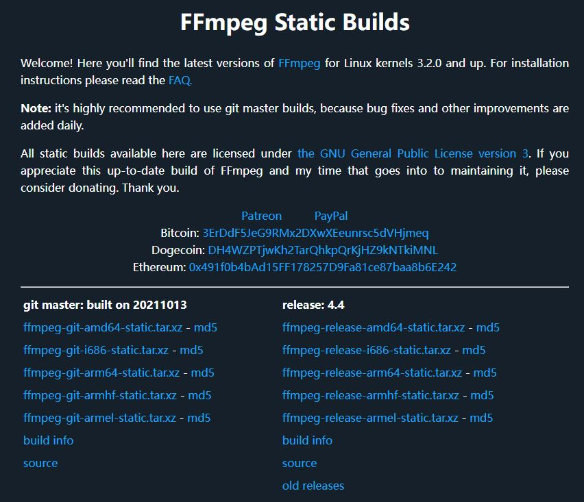

# Ubuntu 16.04/18.04/20.04 安装 ffmpeg4.4

​        最近在玩以太网推视频流。由于自身不是做上层应用层软件出生，只能现有工具的手段完成。通过Google和度娘搜索有两种方案：FFmpeg和GStreamer的方案。最终我选择使用FFmpeg工具。

​        [FFmpeg_百度百科 (baidu.com)](https://baike.baidu.com/item/ffmpeg/2665727?fr=aladdin) 是一套可以用来记录、转换数字音频、视频，并能将其转化为流的开源计算机程序。采用LGPL或[GPL](https://baike.baidu.com/item/GPL/2357903)许可证。它提供了录制、转换以及流化音视频的完整解决方案。它包含了非常先进的音频/视频编解码库libavcodec，为了保证高可移植性和编解码质量，libavcodec里很多code都是从头开发的。

FFmpeg在[Linux](https://baike.baidu.com/item/Linux/27050)平台下开发，但它同样也可以在其它操作系统环境中编译运行，包括[Windows](https://baike.baidu.com/item/Windows/165458)、[Mac OS X](https://baike.baidu.com/item/Mac OS X/470629)等。这个项目最早由Fabrice Bellard发起，2004年至2015年间由Michael Niedermayer主要负责维护。许多FFmpeg的开发人员都来自[MPlayer](https://baike.baidu.com/item/MPlayer/3086899)项目，而且当前FFmpeg也是放在MPlayer项目组的服务器上。项目的名称来自MPEG[视频编码标准](https://baike.baidu.com/item/视频编码标准/3201394)，前面的"FF"代表"Fast Forward"。 [1] FFmpeg编码库可以使用[GPU](https://baike.baidu.com/item/GPU/105524)加速。

​        我的Linux服务器是Ubuntu16.04。下面方法适用于Ubuntu16.04以上任何版本的Ubuntu。

## 给当前Ubuntu添加PPA源

​        PPA是Personal Package Archives首字母简写。翻译为中文意思是：个人软件包文档。只有Ubuntu用户可以用，而所有的PPA都是寄存在[launchpad.net](https://launchpad.net/)网站上。使用PPA的好处是Ubuntu系统中使用PPA源的软件可以让你在第一时间体验到最新版本的软件。

​        所以我们需要在[launchpad.net](https://launchpad.net/)网站上搜索我们对应Ubuntu16.04的ffmpeg4 ppa软件包。


点开[FFmpeg 4 - media tool (Xenial & newer) : Rob Savoury](https://launchpad.net/~savoury1/+archive/ubuntu/ffmpeg4)


非常感谢**Rob Savoury**，他的**ppa:savoury1**包含了Ubuntu版本比较多从Ubuntu 16.04(Xenial)到Ubuntu20.04(Focal)。


**增加PPA并升级相应的软件包：**

```bash
$ sudo add-apt-repository ppa:savoury1/graphics
$ sudo add-apt-repository ppa:savoury1/multimedia
$ sudo add-apt-repository ppa:savoury1/ffmpeg4
$ sudo apt-get update
$ sudo apt-get upgrade && sudo apt-get dist-upgrade
$ sudo apt-get install ffmpeg

```

命令log如下：

```bash
$ sudo add-apt-repository ppa:savoury1/graphics
$ sudo add-apt-repository ppa:savoury1/multimedia
$ sudo add-apt-repository ppa:savoury1/ffmpeg4
 FFmpeg 4.4 builds (and associated multimedia packages) for Xenial & newer.

Update (8 May 2021): FFmpeg 4.4 uploads from today onwards are built with these additional optional libraries: glslang (shader support), SVT-AV1 (scalable AV1 encoder), zimg (scaling, colorspace conversion, dithering), Vulkan (GPU acceleration on supported hardware), and SMB (Samba sharing).

==========================================================================
                   FFmpeg 4 - media tool (Xenial & newer)
==========================================================================

......
......

*** Install ***

FFmpeg can be installed from this PPA alone, as the required packages to satisfy minimum versions have been copied here (notify me if any missing). However, if _all_ newest versions of graphics and multimedia packages are desired then two additional PPAs can be added before installing FFmpeg:

  sudo add-apt-repository ppa:savoury1/graphics
  sudo add-apt-repository ppa:savoury1/multimedia
  sudo add-apt-repository ppa:savoury1/ffmpeg4
  sudo apt-get update
  sudo apt-get upgrade && sudo apt-get dist-upgrade
  sudo apt-get install ffmpeg

......
......

*** Build ***

This PPA has build dependencies on:

  ppa:savoury1/build-tools
  ppa:savoury1/backports
  ppa:savoury1/graphics
  ppa:savoury1/multimedia

*** Credits ***

......
......

Press [ENTER] to continue or ctrl-c to cancel adding it

gpg: keyring `/tmp/tmpq1hloyh6/secring.gpg' created
gpg: keyring `/tmp/tmpq1hloyh6/pubring.gpg' created
gpg: requesting key FB006459 from hkp server keyserver.ubuntu.com
gpg: /tmp/tmpq1hloyh6/trustdb.gpg: trustdb created
gpg: key FB006459: public key "Launchpad PPA for Rob Savoury" imported
gpg: Total number processed: 1
gpg:               imported: 1  (RSA: 1)
OK
$ sudo apt-get update
Hit:1 http://mirrors.aliyun.com/docker-ce/linux/ubuntu xenial InRelease
Hit:2 https://mirrors.aliyun.com/docker-ce/linux/ubuntu xenial InRelease                                                         Hit:3 http://ppa.launchpad.net/savoury1/ffmpeg4/ubuntu xenial InRelease                                                         ......
......
Get:23 http://ppa.launchpad.net/savoury1/multimedia/ubuntu xenial/main Translation-en [113 kB]                                   
Fetched 2,023 kB in 8s (234 kB/s)                                                      
Reading package lists... Done
W: Duplicate sources.list entry https://mirrors.aliyun.com/docker-ce/linux/ubuntu xenial Release

$ sudo apt-get upgrade && sudo apt-get dist-upgrade
$ sudo apt-get install ffmpeg
```

**Check当前ffmpeg的版本：**

```bash
$ ffmpeg -version
ffmpeg version 4.4-1ubuntu0~16.04.sav0.1 Copyright (c) 2000-2021 the FFmpeg developers
built with gcc 5.4.0 (Ubuntu 5.4.0-6ubuntu1~16.04.12) 20160609
configuration: --prefix=/usr --extra-version='1ubuntu0~16.04.sav0.1' --toolchain=hardened --libdir=/usr/lib/x86_64-linux-gnu --incdir=/usr/include/x86_64-linux-gnu --arch=amd64 --enable-gpl --disable-stripping --enable-avresample --disable-filter=resample --enable-gnutls --enable-ladspa --enable-libaom --enable-libass --enable-libbluray --enable-libbs2b --enable-libcaca --enable-libcdio --enable-libcodec2 --enable-libdav1d --enable-libflite --enable-libfontconfig --enable-libfreetype --enable-libfribidi --enable-libgme --enable-libgsm --enable-libjack --enable-libmp3lame --enable-libmysofa --enable-libopenjpeg --enable-libopenmpt --enable-libopus --enable-libpulse --enable-librabbitmq --enable-librubberband --enable-libshine --enable-libsnappy --enable-libsoxr --enable-libspeex --enable-libsrt --enable-libssh --enable-libtheora --enable-libtwolame --enable-libvidstab --enable-libvorbis --enable-libvpx --enable-libwebp --enable-libx265 --enable-libxml2 --enable-libxvid --enable-libzimg --enable-libzmq --enable-libzvbi --enable-lv2 --enable-omx --enable-openal --enable-opencl --enable-opengl --enable-sdl2 --enable-pocketsphinx --enable-librsvg --enable-crystalhd --enable-libmfx --enable-libdc1394 --enable-libdrm --enable-libiec61883 --enable-nvenc --enable-chromaprint --enable-frei0r --enable-libx264 --enable-shared
libavutil      56. 70.100 / 56. 70.100
libavcodec     58.134.100 / 58.134.100
libavformat    58. 76.100 / 58. 76.100
libavdevice    58. 13.100 / 58. 13.100
libavfilter     7.110.100 /  7.110.100
libavresample   4.  0.  0 /  4.  0.  0
libswscale      5.  9.100 /  5.  9.100
libswresample   3.  9.100 /  3.  9.100
libpostproc    55.  9.100 / 55.  9.100

```


## 给开发板安装FFmpeg-static

由于开发板跑Linux不具备和PC Ubuntu一样的能力。所以最快捷的方式是使用FFmpeg-static静态编译，生成可执行文件直接在板子上跑。

这个得感谢github的**[Jonas Chevalier](https://github.com/zimbatm/ffmpeg-static)**和**[John Van Sickle](https://www.johnvansickle.com/ffmpeg/)**。两个人分别提供了现成的编译脚本或者编译文件。

##### 1. 首先我说一下**Jonas Chevalier**如何编译。

Ubuntu用户直接用下面一条命令即可：

```bash
sudo ./build-ubuntu.sh   #似乎这个5年没有人更新了编译有问题。这个必须是基于Ubuntu18.04的版本。
```

最近更新的是[Dockerfile](https://github.com/zimbatm/ffmpeg-static/blob/master/Dockerfile)和[build.sh](https://github.com/zimbatm/ffmpeg-static/blob/master/build.sh)。浏览了Dockerfile

```bash
FROM ubuntu:bionic
# bionic is Ubuntu18.04
# Basic packages needed to download dependencies and unpack them.
RUN apt-get update && apt-get install -y \
  bzip2 \
  perl \
  tar \
  wget \
  xz-utils \
  && rm -rf /var/lib/apt/lists/*

# Install packages necessary for compilation.
RUN apt-get update && apt-get install -y \
  autoconf \
  automake \
  bash \
  build-essential \
  cmake \
  curl \
  frei0r-plugins-dev \
  gawk \
  libfontconfig-dev \
  libfreetype6-dev \
  libopencore-amrnb-dev \
  libopencore-amrwb-dev \
  libsdl2-dev \
  libspeex-dev \
  libtheora-dev \
  libtool \
  libva-dev \
  libvdpau-dev \
  libvo-amrwbenc-dev \
  libvorbis-dev \
  libwebp-dev \
  libxcb1-dev \
  libxcb-shm0-dev \
  libxcb-xfixes0-dev \
  libxvidcore-dev \
  lsb-release \
  pkg-config \
  sudo \
  tar \
  texi2html \
  yasm \
  && rm -rf /var/lib/apt/lists/*

# Copy the build scripts.
COPY dl.tar.gz build.sh download.pl env.source fetchurl /ffmpeg-static/

VOLUME /ffmpeg-static
WORKDIR /ffmpeg-static
CMD /bin/bash
```

所以我基于Docker编译,如何搭建Docker环境，大家可以参考**[Ubuntu16.04/18.04/20.04下安装Docker](https://my.oschina.net/weitao520lin/blog/5280239)**。

由于国内强的问题，build.sh里去下载文件的时候会失败。大家可以wget https://gitee.com/msntec/open-source-tool/blob/master/ffmpeg/static/dl.tar.gz到ffmpeg-static目录里。

```bash
# 根据当前目录的Dockerfile创建ffmpeg-static镜像
$ docker build -t ffmpeg-static .
# 运行ffmpeg-static镜像
$ docker run -it ffmpeg-static
# 编译生成静态文件
$ ./build.sh 
```

静态的ffmpeg等文件即将被创建再`/ffmpeg-static/bin`目录下：

```bash
root@54ad0ea1b861:/ffmpeg-static/bin# ls -al
total 85340
drwxr-xr-x 2 root root     4096 Oct 15 09:23 .
drwxr-xr-x 6 root root     4096 Oct 15 09:06 ..
-rwxr-xr-x 1 root root 40376352 Oct 15 09:23 ffmpeg
-rwxr-xr-x 1 root root 40286240 Oct 15 09:23 ffprobe
-rwxr-xr-x 1 root root  1910448 Oct 15 09:06 nasm
-rwxr-xr-x 1 root root  1369576 Oct 15 09:06 ndisasm
-rwxr-xr-x 1 root root  1143080 Oct 15 09:06 vsyasm
-rwxr-xr-x 1 root root  1142992 Oct 15 09:06 yasm
-rwxr-xr-x 1 root root  1134160 Oct 15 09:06 ytasm
root@54ad0ea1b861:/ffmpeg-static/bin# 
```

##### 2. 我们在说一下John Van Sickle的方法。

John Van Sickle比较直接他已经提供好了直接的静态镜像给大家。



x86_64,x86_32,Arm64,Arm32静态镜像都有。也提供相应的静态编译源码给大家自行编译。

下面我直接拿x86_64解压作为运行事例

```bash
$ wget https://johnvansickle.com/ffmpeg/releases/ffmpeg-release-amd64-static.tar.xz
--2021-10-15 17:47:56--  https://johnvansickle.com/ffmpeg/releases/ffmpeg-release-amd64-static.tar.xz
Resolving johnvansickle.com (johnvansickle.com)... 107.180.57.212
Connecting to johnvansickle.com (johnvansickle.com)|107.180.57.212|:443... connected.
HTTP request sent, awaiting response... 200 OK
Length: 39577132 (38M) [application/x-xz]
Saving to: ‘ffmpeg-release-amd64-static.tar.xz’

ffmpeg-release-amd64-static.tar.xz                                100%[============================================================================================================================================================>]  37.74M  6.32MB/s    in 8.3s    

2021-10-15 17:48:05 (4.55 MB/s) - ‘ffmpeg-release-amd64-static.tar.xz’ saved [39577132/39577132]

$ tar -xvJf ffmpeg-release-amd64-static.tar.xz
ffmpeg-4.4-amd64-static/
ffmpeg-4.4-amd64-static/GPLv3.txt
ffmpeg-4.4-amd64-static/manpages/
ffmpeg-4.4-amd64-static/manpages/ffmpeg-all.txt
......
......
ffmpeg-4.4-amd64-static/model/vmaf_v0.6.1neg.pkl
ffmpeg-4.4-amd64-static/readme.txt
ffmpeg-4.4-amd64-static/ffmpeg

$ cd ffmpeg-4.4-amd64-static/
$ ./ffmpeg -version
ffmpeg version 4.4-static https://johnvansickle.com/ffmpeg/  Copyright (c) 2000-2021 the FFmpeg developers
built with gcc 8 (Debian 8.3.0-6)
configuration: --enable-gpl --enable-version3 --enable-static --disable-debug --disable-ffplay --disable-indev=sndio --disable-outdev=sndio --cc=gcc --enable-fontconfig --enable-frei0r --enable-gnutls --enable-gmp --enable-libgme --enable-gray --enable-libaom --enable-libfribidi --enable-libass --enable-libvmaf --enable-libfreetype --enable-libmp3lame --enable-libopencore-amrnb --enable-libopencore-amrwb --enable-libopenjpeg --enable-librubberband --enable-libsoxr --enable-libspeex --enable-libsrt --enable-libvorbis --enable-libopus --enable-libtheora --enable-libvidstab --enable-libvo-amrwbenc --enable-libvpx --enable-libwebp --enable-libx264 --enable-libx265 --enable-libxml2 --enable-libdav1d --enable-libxvid --enable-libzvbi --enable-libzimg
libavutil      56. 70.100 / 56. 70.100
libavcodec     58.134.100 / 58.134.100
libavformat    58. 76.100 / 58. 76.100
libavdevice    58. 13.100 / 58. 13.100
libavfilter     7.110.100 /  7.110.100
libswscale      5.  9.100 /  5.  9.100
libswresample   3.  9.100 /  3.  9.100
libpostproc    55.  9.100 / 55.  9.100

$  ldd ./ffmpeg 
	not a dynamic executable
```

##### 查看帮助

```bash
$ ffmpeg -bsfs      #可用的bit流 
$ ffmpeg -codecs    #可用的编解码器
$ ffmpeg -decoders  #可用的解码器
$ ffmpeg -encoders  #可用的编码器
$ ffmpeg -filters   #可用的过滤器
$ ffmpeg -formats   #可用的视频格式
$ ffmpeg -layouts   #可用的声道布局
$ ffmpeg -L         #可用的license
$ ffmpeg -pix_fmts  #可用的像素格式
$ ffmpeg -protocals #可用的协议
```

##### 录屏

```bash
ffmpeg -video_size 1920x1080 -framerate 25 -f x11grab -i :0.0 out.mp4
```

##### UDP推流

```bash
ffmpeg -f x11grab -i :0.0 -s 1920x720 -r 50 -vcodec libx264 -preset ultrafast -tune zerolatency -crf 18 -f mpegts udp://192.168.2.102:1234
ffplay -protocol_whitelist "file,udp,rtp" -i udp://192.168.2.102:1234
```

##### 录屏和录音推流命令，不带GPU加速

```bash
ffmpeg -f x11grab -video_size 1920x1080 -framerate 25 -i :0.0+0,0 -f alsa -ac 2 -i default -vcodec libx264 -acodec libmp3lame -ar 44100 -b:a 128k -f mpegts udp://127.0.0.1:1234

[x11grab @ 0x55ef43bdca40] Stream #0: not enough frames to estimate rate; consider increasing probesize
Input #0, x11grab, from ':0.0+0,0':
  Duration: N/A, start: 1634292242.014571, bitrate: 1658880 kb/s
  Stream #0:0: Video: rawvideo (BGR[0] / 0x524742), bgr0, 1920x1080, 1658880 kb/s, 25 fps, 1000k tbr, 1000k tbn, 1000k tbc
Guessed Channel Layout for Input Stream #1.0 : stereo
Input #1, alsa, from 'default':
  Duration: N/A, start: 1634292241.886154, bitrate: 1536 kb/s
  Stream #1:0: Audio: pcm_s16le, 48000 Hz, stereo, s16, 1536 kb/s
Stream mapping:
  Stream #0:0 -> #0:0 (rawvideo (native) -> h264 (libx264))
  Stream #1:0 -> #0:1 (pcm_s16le (native) -> mp3 (libmp3lame))
Press [q] to stop, [?] for help
[libx264 @ 0x55ef43c3b440] using cpu capabilities: MMX2 SSE2Fast SSSE3 SSE4.2 AVX
[libx264 @ 0x55ef43c3b440] profile High 4:4:4 Predictive, level 4.0, 4:4:4, 8-bit
Output #0, mpegts, to 'udp://127.0.0.1:1234':
  Metadata:
    encoder         : Lavf58.76.100
  Stream #0:0: Video: h264, yuv444p(tv, progressive), 1920x1080, q=2-31, 25 fps, 90k tbn
    Metadata:
      encoder         : Lavc58.134.100 libx264
    Side data:
      cpb: bitrate max/min/avg: 0/0/0 buffer size: 0 vbv_delay: N/A
  Stream #0:1: Audio: mp3, 44100 Hz, stereo, s16p, 128 kb/s
    Metadata:
      encoder         : Lavc58.134.100 libmp3lame
[alsa @ 0x55ef43be4900] Thread message queue blocking; consider raising the thread_queue_size option (current value: 8)
[alsa @ 0x55ef43be4900] ALSA buffer xrun.
frame=   81 fps= 23 q=-1.0 Lsize=     138kB time=00:00:03.20 bitrate= 353.9kbits/s dup=0 drop=1 speed=0.901x
```

##### 录屏和录音推流命令，带GPU加速。H264+mp3编码

```bash
ffmpeg -f x11grab -video_size 1920x1080 -framerate 25 -i :0.0+0,0 -f alsa -ac 2 -i default -ar 44100 -b:a 128k -acodec libmp3lame -vcodec h264_vaapi -vf scale=1600:900 -f mpegts udp://127.0.0.1:1234
```

##### 录屏和录音推流命令，带GPU加速。H264+aac编码

```bash
ffmpeg -f x11grab -video_size 1920x1080 -framerate 25 -i :0.0+0,0 -f alsa -ac 2 -i default -vcodec h264_vaapi -acodec aac -ar 44100 -b:a 128k -f mpegts udp://127.0.0.1:1234
```

